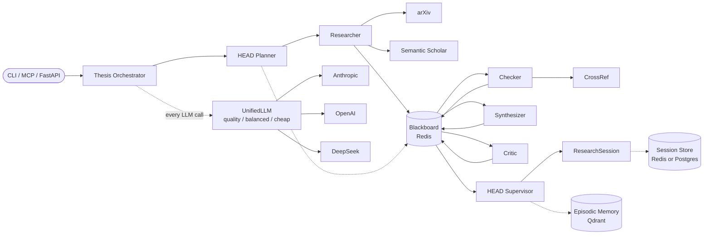

# OpenWorkers

[](https://github.com/DavidHavoc/openworkers/actions/workflows/ci.yml)
[](#install)
[](LICENSE-MIT)
[](https://github.com/psf/black)
[](https://github.com/astral-sh/ruff)

A multi-agent system that **refuses to make things up**. Two domains live here today:

- **Thesis assistant** — audits literature claims against arXiv / Semantic Scholar / CrossRef.
- **Code audit** *(new flagship, in progress)* — audits factual claims in technical artefacts (READMEs first, then PRs / compliance docs / architecture docs) against the actual codebase, language specs, and dependencies.

Both domains share the same DNA: a hierarchical pipeline (planner → researcher → checker → critic) producing structured JSON, with provider-agnostic LLM routing across Anthropic, OpenAI, and DeepSeek and a hard trust gate that **refuses to verdict without evidence**.

> **Project status:** 0.1.0 (pre-release). The thesis pipeline runs end-to-end; the code-audit track has landed its first slice (`openworkers audit readme <repo>`). APIs may shift before 1.0. See [ROADMAP.md](ROADMAP.md) for direction, [AGENTS.md](AGENTS.md) for contributor context.

## Code audit *(new track)*

`openworkers audit readme <repo>` and `openworkers audit pr <github-pr-url>` extract every factual claim from a README or PR description and verdict each one against the actual repository / diff:

| Verdict | Meaning |
|---|---|
| `verified` | Code clearly demonstrates the claim is true |
| `drifted` | A related but divergent implementation exists (renamed flag, changed default, etc.) |
| `contradicted` | Code directly disproves the claim |
| `unsupported` | No evidence in the repo — enforced in code, not delegated to the LLM |

Both auditors use the same pipeline: planner (LLM extracts claims) → researcher (deterministic grep via a `SourceAdapter` — `LocalRepoAdapter` for repos, `GitHubAdapter` for PR diffs) → checker (LLM judges + trust gate forces `unsupported` when evidence is empty) → critic (adversarial pass). The audited artefact is excluded from its own evidence pool, so fabricated claims cannot verify themselves.

`audit pr` reads `GITHUB_TOKEN` or `GH_TOKEN` for higher rate limits; offline testing uses canned fixtures via `--fixture <dir>` (see `tests/fixtures/sample_pr/`).

Roadmap for this track: compliance auditor (security/policy claims vs. code), architecture auditor (design doc vs. implementation), layered source adapters (specs / RFCs / dependency source), tool/source registry, Ollama for local inference on private repos. See [AGENTS.md](AGENTS.md) for the contributor recipe.

## What it does

| # | Capability | Notes |
|---|-----------|-------|
| 1 | **Literature Map** | arXiv + Semantic Scholar; classifies results as supporting / challenging / adjacent |
| 2 | **Citation Audit** | Flags missing, weak, contested citations across the lit set |
| 3 | **Synthesis Report** | Methods, datasets, metrics; cross-paper comparisons |
| 4 | **Structured Critique** | Strengths, weaknesses, gaps, counterarguments, suggestions — JSON, never prose |
| 5 | **Corpus Benchmarks** | Ingest thesis PDFs; compare your section length and citation density to a reference corpus |
| 6 | **Idea/Draft Critique** | Standalone critique without running a full pipeline |
| 7 | **Citation Verification** | DOI lookup via CrossRef; returns metadata or reports it does not exist |
| 8 | **Quick Paper Search** | arXiv / Semantic Scholar by keyword — no LLM, no token cost |
| 9 | **Session Persistence** | Resume past sessions; list and filter by discipline/status (Redis or Postgres) |
| 10 | **Multi-Provider Router** | quality / balanced / cheap tiers with health checks, fallback chains, budget tracking |
| 11 | **Privacy Tiers** | public / sanitized / trusted gate which data sources each agent can access |
| 12 | **JSON Output** | Every command supports `--format json` and `--output file.json` |
| 13 | **MCP Server** | Four tools over stdio for Claude Code, OpenCode, and any MCP-aware client |
| 14 | **Evaluation Harness** | Built-in tests for routing correctness, search recall, fake-DOI detection |
| 15 | **Dockerized** | Compose stack with Redis, Qdrant, CLI runner, and MCP service |
| 16 | **User RAG over PDFs** | `thesis ingest add paper.pdf --collection my_papers` chunks + embeds; researcher transparently retrieves alongside arXiv/SS via `thesis research ... --rag-collection my_papers` |

## Architecture



Full pipeline-stage table and routing detail in [docs/architecture.md](docs/architecture.md).

## Install

Python 3.12 is recommended (the test matrix runs 3.9 and 3.12). Redis is required at runtime; Qdrant runs embedded by default.

```bash
git clone https://github.com/DavidHavoc/openworkers.git
cd openworkers
python3 -m venv .venv && source .venv/bin/activate
pip install -e ".[dev]"
```

## Configure

Copy `.env.example` to `.env` and pick **one** provider configuration. A minimal single-provider setup:

```env
DEEPSEEK_API_KEY=sk-...
THESIS_QUALITY_PROVIDER=deepseek
THESIS_QUALITY_MODEL=deepseek-chat
THESIS_BALANCED_PROVIDER=deepseek
THESIS_BALANCED_MODEL=deepseek-chat
THESIS_CHEAP_PROVIDER=deepseek
THESIS_CHEAP_MODEL=deepseek-chat
DRY_RUN=false
```

The three modes route different agents to different models so you can pay strong-model rates only where they matter:

| Mode | Used by | Suggested model class |
|------|---------|-----------------------|
| `quality` | HEAD planner, HEAD supervisor, critic | strongest |
| `balanced` | checker, synthesizer | mid |
| `cheap` | researcher | cheap / fast |

`DRY_RUN=true` runs the full pipeline without any API keys — useful for tests, demos, and CI.

## Docker

```bash
docker compose build
docker compose up -d redis qdrant
docker compose run --rm cli python -m apps.cli.main research "your question"
```

`cli` and `mcp` services live behind the `tools` profile and start on demand. `.env` is mounted automatically.

## CLI

```bash
thesis research "Can light replace electrons in CPUs?" --discipline computer_science
thesis research "..." --rag-collection my_papers   # also retrieve from your own PDFs
thesis critique "Social media causes depression because teens spend too much time online"
thesis verify "10.1038/nature14539"
thesis papers "transformer attention" --source arxiv --limit 5
thesis corpus thesis.pdf --title "My Thesis" --discipline cs --year 2024
thesis ingest add paper.pdf --collection my_papers   # add to your RAG corpus
thesis ingest list
thesis sessions
thesis resume <session-id>
```

Every command accepts `--format json` and `--output path/to/file.json`. See [docs/examples.md](docs/examples.md) for full sample outputs.

## MCP Server (Claude Code, OpenCode, and other MCP clients)

The server exposes four tools over stdio: `thesis_research`, `thesis_critique`, `thesis_verify_citation`, `thesis_search_papers`.

**Claude Code** — add to `~/.claude/mcp.json` or a project-level `.mcp.json`:

```json
{
  "mcpServers": {
    "thesis-assistant": {
      "command": "/absolute/path/to/.venv/bin/python",
      "args": ["-m", "apps.mcp_server.main"]
    }
  }
}
```

**OpenCode** — add to `~/.config/opencode/opencode.json`:

```json
{
  "mcp": {
    "thesis-assistant": {
      "type": "local",
      "command": [
        "bash", "-lc",
        "cd /absolute/path/to/openworkers && docker compose run --rm -i mcp"
      ]
    }
  }
}
```

Replace `/absolute/path/to/openworkers` with your local checkout path. Conversation examples live in [docs/examples.md](docs/examples.md).

## How OpenWorkers compares

OpenWorkers is for *researching* a thesis, not writing one. The closest analogues are research-discovery tools, not generic chat:

| Capability                          | OpenWorkers | Generic LLM Chat | Elicit | scite | Connected Papers |
|-------------------------------------|:-----------:|:----------------:|:------:|:-----:|:----------------:|
| Refuses to write prose for you      | ✅          | ❌               | partial| n/a   | n/a              |
| arXiv + Semantic Scholar search     | ✅          | ❌               | ✅     | ✅    | ✅               |
| CrossRef DOI verification           | ✅          | ❌               | partial| ✅    | ❌               |
| Structured critique (JSON schema)   | ✅          | ❌               | ❌     | ❌    | ❌               |
| Corpus benchmarking from your PDFs  | ✅          | ❌               | ❌     | ❌    | ❌               |
| Multi-provider LLM routing          | ✅          | ❌               | ❌     | ❌    | ❌               |
| MCP / editor integration            | ✅          | n/a              | ❌     | ❌    | ❌               |
| Self-hostable, MIT-licensed         | ✅          | ❌               | ❌     | ❌    | ❌               |

## Contributing

Bug fixes, docs, features, and provider integrations welcome. Before opening a PR, run:

```bash
pytest tests/ -v
ruff check . && black --check .
mypy core/ providers/ --strict --ignore-missing-imports
```

See [CONTRIBUTING.md](CONTRIBUTING.md) for the full workflow.

## License

[MIT](LICENSE-MIT).

## FastAPI app

The FastAPI app (`apps/api/main.py`) provides an async HTTP interface for programmatic access. Start it with:

```bash
uvicorn apps.api.main:app --reload
# or
make dev
```

The server starts on `http://localhost:8000` by default. Interactive docs are available at `http://localhost:8000/docs`.

### Endpoints

| Method | Path | Description |
|--------|------|-------------|
| `GET` | `/health` | Health check — returns status and pending task count |
| `POST` | `/tasks/` | Submit a research task (returns `task_id`, status `202`) |
| `GET` | `/tasks/` | List all tasks with their current status |
| `GET` | `/tasks/{task_id}` | Poll a task for status and result |
| `DELETE` | `/tasks/{task_id}` | Remove a completed or failed task |

### Example: submit and poll a task

```bash
# Submit
curl -s -X POST http://localhost:8000/tasks/ \
  -H "Content-Type: application/json" \
  -d '{"query": "Does retrieval-augmented generation improve factuality?", "discipline": "computer_science", "mode": "balanced"}' \
| jq .
# {"task_id": "abc-123", "status": "queued", "created_at": "..."}

# Poll until complete
curl -s http://localhost:8000/tasks/abc-123 | jq '.status'
```

**Request fields:**

| Field | Required | Default | Description |
|-------|----------|---------|-------------|
| `query` | yes | — | Research question to investigate |
| `discipline` | no | `general` | Subject area (e.g. `computer_science`, `psychology`) |
| `topic_summary` | no | same as `query` | One-sentence context for the planner |
| `existing_knowledge` | no | `""` | What the user already knows |
| `what_they_need` | no | `""` | Specific output they are looking for |
| `mode` | no | `balanced` | LLM tier to use: `quality`, `balanced`, or `cheap` |

Tasks run asynchronously in the background. Poll `GET /tasks/{task_id}` until `status` is `complete` or `failed`. The `result` field contains a full `ResearchSession` object in the same shape as the CLI JSON output.
