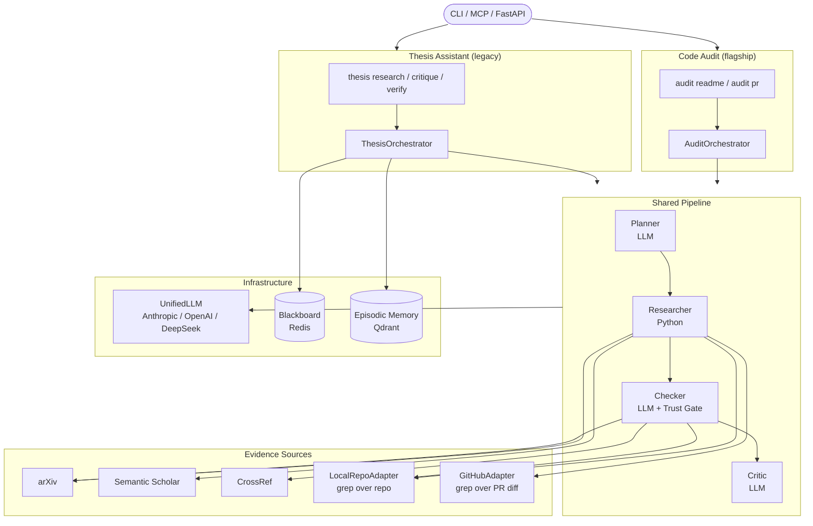

# OpenWorkers

[](https://github.com/DavidHavoc/openworkers/actions/workflows/ci.yml)
[](#install)
[](LICENSE-MIT)
[](https://github.com/psf/black)
[](https://github.com/astral-sh/ruff)

**The multi-agent system that refuses to make things up.**

Every claim the system emits is either tied to a verifiable primary source or marked as unsupported. Two domains run in this codebase: a **code auditor** that verdicts factual claims in technical artefacts against the actual codebase, and a **thesis assistant** that audits literature claims against academic sources. Same DNA — planner → researcher → checker → critic, structured JSON everywhere, a hard trust gate enforced in code.

---

## Quick start

```bash
git clone https://github.com/DavidHavoc/openworkers.git
cd openworkers
python3 -m venv .venv && source .venv/bin/activate
pip install -e ".[dev]"
```

Copy `.env.example` to `.env`, add at least one API key, and pick a provider:

```env
DEEPSEEK_API_KEY=sk-...
THESIS_QUALITY_PROVIDER=deepseek
THESIS_QUALITY_MODEL=deepseek-chat
THESIS_BALANCED_PROVIDER=deepseek
THESIS_BALANCED_MODEL=deepseek-chat
THESIS_CHEAP_PROVIDER=deepseek
THESIS_CHEAP_MODEL=deepseek-chat
DRY_RUN=false
```

## Code audit

Audit factual claims in READMEs and pull requests against the codebase. Every claim gets one of four verdicts:

| Verdict | Meaning |
|---|---|
| `verified` | Code clearly demonstrates the claim is true |
| `drifted` | A related but divergent implementation exists (renamed flag, changed default, etc.) |
| `contradicted` | Code directly disproves the claim |
| `unsupported` | No evidence in the repo — enforced in Python, not delegated to the LLM |

### Audit a README

```bash
openworkers audit readme /path/to/any/repo
```

Example output (synthetic widgetlib):

```json
{
  "claims": [
    {
      "text": "WidgetLib supports both synchronous and asynchronous widget creation.",
      "quote": "Create widgets via WidgetFactory synchronously or with WidgetFactoryAsync.",
      "claim_type": "feature",
      "verdict": "verified",
      "confidence": 0.92,
      "evidence_paths": ["widgetlib/factory.py:30-42"]
    },
    {
      "text": "The default widget timeout is 30 seconds.",
      "quote": "Time out after 30 seconds.",
      "claim_type": "feature",
      "verdict": "drifted",
      "confidence": 0.78,
      "evidence_paths": ["widgetlib/config.py:12"],
      "notes": "Default is 45 seconds in code; 30 was the v0.1 value."
    },
    {
      "text": "Built-in PostgreSQL support.",
      "quote": "WidgetLib includes native PostgreSQL support.",
      "claim_type": "feature",
      "verdict": "unsupported",
      "confidence": 0.0,
      "evidence_paths": [],
      "notes": "No supporting evidence found in the repository."
    }
  ],
  "critique": {
    "weak_verdicts": ["timeout claim — grep for '30' only; the 45-second constant uses a different syntax"],
    "missed_claims": ["README mentions 'rate limiting' but planner didn't extract it"],
    "suggestions": ["Re-run with expanded search hints for timeout-related constants"]
  }
}
```

The audited README is excluded from its own evidence pool — claims cannot verify themselves against the text that makes them.

### Audit a pull request

```bash
openworkers audit pr https://github.com/owner/repo/pull/42
```

Uses `GITHUB_TOKEN` or `GH_TOKEN` for higher rate limits (anonymous works for public repos at 60 req/hour). The PR description is extracted by the planner; the unified diff is the evidence pool. Claims have PR-specific types: `add`, `remove`, `fix`, `refactor`, `test`, `behavior`, `doc`, `other`. See `tests/fixtures/sample_pr/` for a canned example.

### How the audit pipeline works

Both README and PR auditors share the same four-stage shape, parameterised by source adapter and prompts:

```
Planner (LLM)              extracts atomic claims from the artefact
    ↓
Researcher (Python)        deterministic grep over the codebase via SourceAdapter
    ↓
Checker (LLM + trust gate) judges each (claim, evidence) pair; trust gate overwrites
                           any verdict where evidence is empty — in code, not prompts
    ↓
Critic (LLM)               adversarial pass: weak verdicts, missed claims, suggestions
```

The trust gate (`providers/code_audit_agents.py::_enforce_trust_gate`) is the invariant. A confidently hallucinating checker that says `verified` for a claim with zero evidence gets corrected before the user ever sees the report. See [AGENTS.md](AGENTS.md) for the contributor recipe and [ROADMAP.md](ROADMAP.md) for upcoming slices (compliance auditor, architecture auditor, layered source adapters).

## Thesis assistant (legacy)

Audits literature claims against arXiv, Semantic Scholar, and CrossRef. Produces structured JSON — writing prose is explicitly out of scope. This pipeline is stable and maintained, but code audit is the new flagship.

```bash
thesis research "Can light replace electrons in CPUs?" --discipline computer_science
thesis critique "Social media causes depression because teens spend too much time online"
thesis verify "10.1038/nature14539"
thesis papers "transformer attention" --source arxiv --limit 5
thesis corpus thesis.pdf --title "My Thesis" --discipline cs --year 2024
thesis ingest add paper.pdf --collection my_papers   # RAG over your own PDFs
thesis sessions
thesis resume <session-id>
```

Every command accepts `--format json` and `--output path/to/file.json`. Output examples in [docs/examples.md](docs/examples.md).

### What the thesis assistant does

| # | Capability | Description |
|---|-----------|-------------|
| 1 | Literature map | arXiv + Semantic Scholar; classified as supporting / challenging / adjacent |
| 2 | Citation audit | Flags missing, weak, contested citations across the lit set |
| 3 | Synthesis report | Methods, datasets, metrics; cross-paper comparisons |
| 4 | Structured critique | Strengths, weaknesses, gaps, counterarguments — JSON, never prose |
| 5 | Corpus benchmarks | Compare section length and citation density to reference corpus from your PDFs |
| 6 | Idea/draft critique | Standalone critique without running the full pipeline |
| 7 | Citation verification | DOI lookup via CrossRef; returns metadata or reports it does not exist |
| 8 | Quick paper search | arXiv / Semantic Scholar by keyword — no LLM, no token cost |
| 9 | Session persistence | Resume past sessions; list and filter by discipline/status (Redis or Postgres) |
| 10 | User RAG over PDFs | Ingest your own PDFs; researcher retrieves from them alongside arXiv/SS |

## LLM routing

`UnifiedLLM` routes to Anthropic, OpenAI, and DeepSeek across three tiers:

| Tier | Used by | Suggested model |
|------|---------|-----------------|
| `quality` | HEAD planner, HEAD supervisor, critic | strongest |
| `balanced` | checker, synthesizer | mid |
| `cheap` | researcher | cheap / fast |

Per-provider circuit breakers (pybreaker), tenacity retries with exponential jitter, and a hard budget guard (contextvars-scoped per-session ceiling) keep the system resilient. `DRY_RUN=true` runs the full pipeline without any API keys — useful for CI and wiring tests.

## Architecture



Full detail in [docs/architecture.md](docs/architecture.md).

## MCP server

Exposes four thesis tools over stdio for Claude Code, OpenCode, and any MCP-aware client:

| Tool | Description |
|------|-------------|
| `thesis_research` | Run the full research pipeline |
| `thesis_critique` | Critique an idea or draft |
| `thesis_verify_citation` | Look up a DOI via CrossRef |
| `thesis_search_papers` | Quick arXiv / Semantic Scholar keyword search |

**Claude Code** — add to `~/.claude/mcp.json` or a project-level `.mcp.json`:

```json
{
  "mcpServers": {
    "thesis-assistant": {
      "command": "/absolute/path/to/.venv/bin/python",
      "args": ["-m", "apps.mcp_server.main"]
    }
  }
}
```

**OpenCode** — add to `~/.config/opencode/opencode.json`:

```json
{
  "mcp": {
    "thesis-assistant": {
      "type": "local",
      "command": [
        "bash", "-lc",
        "cd /absolute/path/to/openworkers && docker compose run --rm -i mcp"
      ]
    }
  }
}
```

Replace `/absolute/path/to/openworkers` with your local checkout path.

## Docker

```bash
docker compose build
docker compose up -d redis qdrant
docker compose run --rm cli python -m apps.cli.main research "your question"
```

`cli` and `mcp` services live behind the `tools` profile and start on demand. `.env` is mounted automatically.

## FastAPI

Start the async HTTP interface:

```bash
uvicorn apps.api.main:app --reload
```

Per-IP rate limiting is enabled by default (60 req/min, 1000 req/hour). Configure via `API_RATE_LIMIT_*` env vars or set `API_RATE_LIMIT_ENABLED=false` to disable.

Interactive docs at `http://localhost:8000/docs`.

| Method | Path | Description |
|--------|------|-------------|
| `GET` | `/health` | Health check |
| `POST` | `/tasks/` | Submit a research task → `{task_id, status: "queued"}` |
| `GET` | `/tasks/` | List all tasks |
| `GET` | `/tasks/{task_id}` | Poll task status and result |
| `DELETE` | `/tasks/{task_id}` | Remove a completed or failed task |

```bash
# Submit
curl -s -X POST http://localhost:8000/tasks/ \
  -H "Content-Type: application/json" \
  -d '{"query": "Does retrieval-augmented generation improve factuality?", "discipline": "computer_science"}'

# Poll
curl -s http://localhost:8000/tasks/abc-123 | jq '.status'
```

---

## Contributing

```bash
pytest tests/ -v
ruff check . && black --check .
mypy core/ providers/ --strict --ignore-missing-imports
```

Read [AGENTS.md](AGENTS.md) before touching code. See [CONTRIBUTING.md](CONTRIBUTING.md) for the full workflow.

## License

[MIT](LICENSE-MIT)
