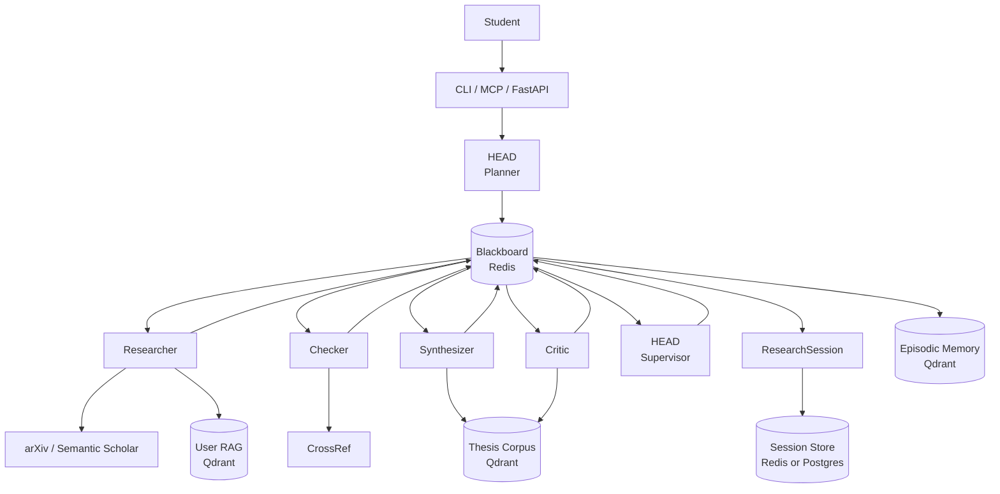

# Architecture

## Pipeline

All agents call through the **UnifiedLLM router** (omitted from the diagram for clarity), which maps `quality` / `balanced` / `cheap` modes to Anthropic, OpenAI, or DeepSeek via env vars. Tool calls (arXiv, Semantic Scholar, CrossRef) hit external APIs directly with no LLM in the loop. Corpus benchmarks make critiques data-driven — *"your methodology is 200 words; CS theses in our corpus average 1,100"* — instead of vague qualitative feedback.

## Pipeline stages

| # | Stage      | Agent             | Output |
|---|------------|-------------------|--------|
| 1 | Plan       | HEAD planner      | `ResearchPlan` — subquestions, search lanes, evidence needs, budget allocation |
| 2 | Memory     | —                 | `MemoryBrief` — guidance synthesised from semantically similar past tasks |
| 3 | Search     | Researcher        | `LitMap` — papers classified supporting / challenging / adjacent |
| 4 | Audit      | Checker           | `CitationAudit` — verified, missing, weak, contested claims |
| 5 | Extract    | Synthesizer       | `SynthesisReport` — methods, datasets, metrics, cross-paper comparisons |
| 5b| Benchmarks | —                 | Corpus context (similar sections + discipline stats) appended to blackboard |
| 6 | Critique   | Critic            | `CritiqueResult` — strengths, weaknesses, gaps, counterarguments |
| 7 | Review     | HEAD supervisor   | Final `CritiqueResult` — merges all findings |
| 8 | Assemble   | —                 | `ResearchSession` — wraps everything; auto-saved to the session store |

Each stage's output is appended to the blackboard so downstream agents see a structured, deduplicated context window rather than raw chat history.

## Routing

The router maps every LLM call to a `(provider, model)` pair via env vars, with health checks and a fallback chain:

| Mode       | Used by                                   | Tier intuition |
|------------|-------------------------------------------|----------------|
| `quality`  | HEAD planner, HEAD supervisor, critic     | strongest available model |
| `balanced` | checker, synthesizer                      | mid-tier model |
| `cheap`    | researcher                                | cheapest / fastest |

- **Health cache** — providers that fail are marked unhealthy for 60 seconds; subsequent calls in that window skip them.
- **Budget guard** — per-session spend is tracked; routing degrades to cheaper paths as the budget runs out, and skips the synthesizer entirely if the remaining USD is below the threshold.
- **Privacy tiers** — `trusted` privacy forces direct HEAD execution with no worker swarm and no external tool calls; `sanitized` strips identifying details before tool calls; `public` is the default.

## Persistence

| Store              | Backend                | Lifetime |
|--------------------|------------------------|----------|
| Blackboard         | Redis (per session)    | Cleared after session completes |
| Session store      | Redis or Postgres      | Default 30-day TTL on Redis; permanent on Postgres |
| Episodic memory    | Qdrant (FastEmbed)     | Permanent — drives `MemoryBrief` for future tasks |
| Thesis corpus      | Qdrant (FastEmbed)     | Permanent — feeds Stage 5b benchmarks |
| User RAG           | Qdrant (FastEmbed)     | Permanent; namespaced under `rag_*` collections; populated by `thesis ingest add` |

`create_session_store()` auto-selects Postgres when `DATABASE_URL` is set, otherwise Redis.

## Observability

Every agent call emits a structured JSON event via `core.observability.metrics.obs_logger`: session lifecycle, stage start/complete/skip/fail, memory hits, fallback events, and budget traces. Search the logs by `session_id` to reconstruct any pipeline run.

## Configuration

All environment variables are declared as typed fields on the `Settings` class in `core/config.py` (pydantic-settings). No module touches `os.environ` directly — every config value is accessed via `get_settings()`, which returns an `lru_cache` singleton.

| Group            | Key variables |
|------------------|---------------|
| Infrastructure   | `REDIS_URL`, `QDRANT_URL`, `DATABASE_URL`, `SESSION_TTL_SECONDS` |
| LLM routing      | `THESIS_QUALITY_PROVIDER/MODEL`, `THESIS_BALANCED_PROVIDER/MODEL`, `THESIS_CHEAP_PROVIDER/MODEL` |
| API keys         | `ANTHROPIC_API_KEY`, `OPENAI_API_KEY`, `DEEPSEEK_API_KEY` |
| Budget guard     | `MAX_BUDGET_USD`, `BUDGET_OUTPUT_TOKEN_FLOOR` |
| Resilience       | `RESILIENCE_RETRY_ATTEMPTS`, `RESILIENCE_RETRY_BASE_SEC`, `RESILIENCE_RETRY_MAX_SEC`, `RESILIENCE_BREAKER_FAIL_MAX`, `RESILIENCE_BREAKER_RESET_SEC` |
| Observability    | `ENVIRONMENT`, `LOG_LEVEL` |
| Embedding cache  | `EMBEDDING_CACHE_DIR` |

Settings are read from environment variables first, with `.env` as a fallback. Unknown variables are silently ignored (`extra="ignore"`). In tests, call `reset_settings(use_env_file=False)` after `monkeypatch.setenv` to clear the singleton and make patched values take effect.

## Structured logging

`core/logging.py` provides a single `configure_logging()` call that wires structlog to the standard library root logger. All third-party loggers (redis, httpx, qdrant) are automatically routed through the same processor chain.

Output format is driven by the `ENVIRONMENT` setting:

- `development` (default) — ConsoleRenderer (structlog.dev.ConsoleRenderer); tracebacks rendered inline; easy to read in a terminal.
- `production` — newline-delimited JSON; ready for ingestion by Datadog, ELK, Cloud Logging, or any log aggregator.

Each entry carries `log_level`, `logger_name`, and an ISO-8601 timestamp. `structlog.contextvars` is included in the chain so any key bound with `structlog.contextvars.bind_contextvars()` (e.g., `session_id`) propagates to every log line emitted within that async context.

`configure_logging()` must be called once at each app entrypoint (`apps/api/`, `apps/mcp_server/`). It must not be called in library code or tests.

## Embedding cache

FastEmbed is used to embed text for all Qdrant operations (episodic memory, thesis corpus, user RAG). Two cache layers prevent redundant work:

1. **Model weight cache** — FastEmbed writes downloaded model weights to `~/.cache/fastembed/` automatically. This survives process restarts.
2. **Vector output cache** — `core/embedding_cache.py` adds a diskcache (SQLite WAL) layer keyed on `sha256(model_name + NUL + text)`. A warm-cache lookup takes ~0.1 ms versus ~20 ms for CPU inference, and it also survives container restarts.

Default cache location: `~/.cache/openworkers/embeddings`. Override with `EMBEDDING_CACHE_DIR`. The cache is thread-safe and safe to call from `asyncio.to_thread`. `diskcache` is an optional dependency — if not installed the embedding path falls back to always running inference.

## Resilience

LLM provider calls pass through a two-layer protection stack in `providers/resilience.py`:

1. **Tenacity retry** — transient errors (timeout, 429, 5xx, network blip) are retried with exponential backoff and random jitter. Permanent errors (auth failure, malformed request, content filter) are not retried and fall through immediately to the next provider in the fallback chain.

2. **pybreaker circuit breaker** — one `CircuitBreaker` per provider, lazily constructed by `ProviderBreakerRegistry`. When a provider accumulates `RESILIENCE_BREAKER_FAIL_MAX` consecutive transient failures the breaker opens and short-circuits further calls for `RESILIENCE_BREAKER_RESET_SEC` seconds. Only transient errors count toward the trip threshold; permanent errors (auth, schema) reset the counter so misconfigured providers do not trip the breaker for other callers.

The two mechanisms compose: `call_with_resilience()` checks the breaker first (fail fast if open), then runs the retry loop inside the breaker's protection. A `CircuitBreakerError` from a tripped breaker is treated the same as any other provider failure by the fallback chain.

## Entry points

Three separate applications share the same `core/` and `providers/` libraries:

| App | Module | Transport | Notes |
|-----|--------|-----------|-------|
| FastAPI task queue | `apps/api/main.py` | HTTP | Accepts `POST /tasks/`, runs the pipeline as a background `asyncio` task, exposes `GET /tasks/{id}` for polling. Task state is held in-process (`_tasks` dict). |
| MCP server | `apps/mcp_server/main.py` | stdio (JSON-RPC 2.0) | Implements `initialize`, `tools/list`, and `tools/call` per the MCP 2024-11-05 protocol. Exposes four tools: `thesis_research`, `thesis_critique`, `thesis_verify_citation`, `thesis_search_papers`. Notifications (requests with `id=null`) are silently dropped. |
| CLI | `apps/cli/main.py` | stdin/stdout | Interactive or scriptable access to the same pipeline. |

All three construct a `ThesisOrchestrator` from the same building blocks (`create_unified_llm()`, `EpisodicMemory`, `Router`, `ToolRegistry`) and call `orch.execute(rc)` to run the pipeline. The API and CLI attach a persistent `session_store`; the MCP server uses an in-memory Qdrant instance (`qdrant_location=":memory:"`) and no persistent session store to avoid external service dependencies when invoked by an IDE plugin.
