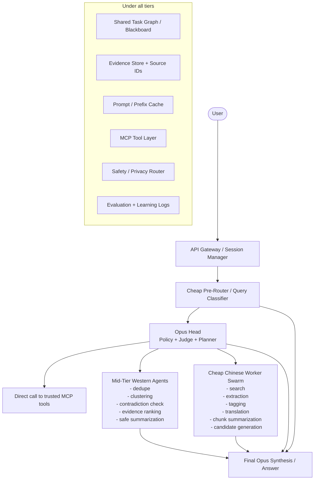

# OpenWorkers Architecture & Integrations

## Core Hierarchy Flow



### Textual Representation
```text
User
  |
  v
API Gateway / Session Manager
  |
  v
Cheap Pre-Router / Query Classifier
  |------------------------------\
  |                               \
  v                                \
Opus Head (Policy + Judge + Planner) \
  |   |    |     |                    \
  |   |    |     |                     \
  |   |    |     +--> Direct call to trusted MCP tools
  |   |    |
  |   |    +--> Mid-Tier Western Agents
  |   |            - dedupe
  |   |            - clustering
  |   |            - contradiction check
  |   |            - evidence ranking
  |   |            - safe summarization
  |   |
  |   +--> Cheap Chinese Worker Swarm
  |                - search
  |                - extraction
  |                - tagging
  |                - translation
  |                - chunk summarization
  |                - candidate generation
  |
  v
Final Opus Synthesis / Answer

Under all tiers:
- Shared Task Graph / Blackboard
- Evidence Store + Source IDs
- Prompt / Prefix Cache
- MCP Tool Layer
- Safety / Privacy Router
- Evaluation + Learning Logs
```

## Security & Tiers
- **Public**: Access to normal web search.
- **Sanitized**: Access to structural datasets safely.
- **Trusted**: Exclusive access to `KnowledgeRetrievalTool`. Trusted tasks bypass generic routing and enforce `head_direct` to avoid leaking traces to cheap workers.

## Observability
All key system jumps emit JSON lines mapping to `obs_logger`, tracking:
- Sessions, latencies, memory hit-rates, and API adapter budgets.
