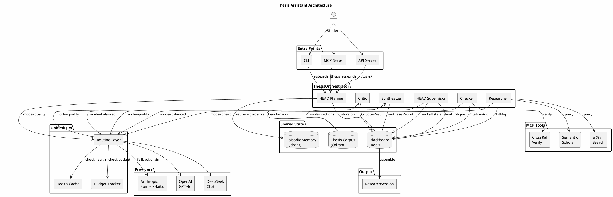

# Architecture

## Thesis Pipeline Flow



## Pipeline Stages

```
1. HEAD planner    → ResearchPlan (subquestions, search lanes, budget)
2. Memory          → MemoryBrief (similar past episodes bias routing)
3. Researcher      → LitMap (papers classified: supporting / challenging / adjacent)
4. Checker         → CitationAudit (verified, missing, weak, contested claims)
5. Synthesizer     → SynthesisReport (methods, datasets, metrics, corpus comparisons)
6. Critic          → CritiqueResult (strengths, weaknesses, gaps, counterarguments)
7. HEAD supervisor → final CritiqueResult (merges all findings, assesses viability)
8. Assemble        → ResearchSession (wraps everything, stores episode in memory)
```

## Routing Layer

The `UnifiedLLM` routing layer maps agent mode to provider + model via env vars:

| Mode | Agents | Env Var | Controls |
|---|---|---|---|
| `quality` | HEAD planner, HEAD supervisor, critic | `THESIS_QUALITY_PROVIDER` / `_MODEL` | Provider + model |
| `balanced` | checker, synthesizer | `THESIS_BALANCED_PROVIDER` / `_MODEL` | Provider + model |
| `cheap` | researcher | `THESIS_CHEAP_PROVIDER` / `_MODEL` | Provider + model |

**Fallback:** If a provider fails or has no API key, the next available provider is tried. Health checks are cached for 60 seconds.

## Observability

All pipeline stages emit structured JSON via `obs_logger`: session start, stage completion, failures, memory hits, budget traces.

## Security Tiers

- **Public**: MCP tools, web search
- **Sanitized**: Structured data lookups
- **Trusted**: No external API calls, HEAD-only resolution
