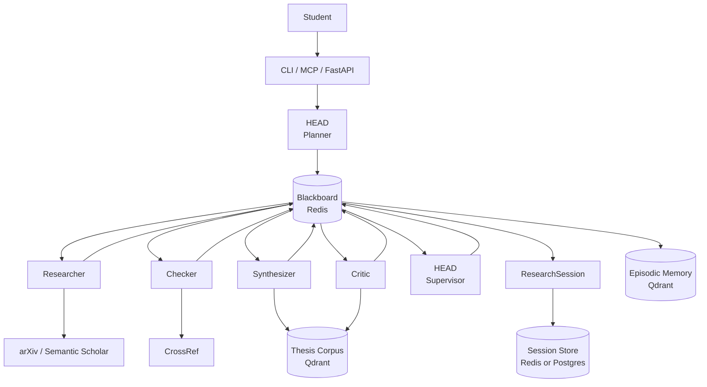

# Architecture

## Pipeline

All agents call through the **UnifiedLLM router** (omitted from the diagram for clarity), which maps `quality` / `balanced` / `cheap` modes to Anthropic, OpenAI, or DeepSeek via env vars. Tool calls (arXiv, Semantic Scholar, CrossRef) hit external APIs directly with no LLM in the loop. Corpus benchmarks make critiques data-driven — *"your methodology is 200 words; CS theses in our corpus average 1,100"* — instead of vague qualitative feedback.

## Pipeline stages

| # | Stage      | Agent             | Output |
|---|------------|-------------------|--------|
| 1 | Plan       | HEAD planner      | `ResearchPlan` — subquestions, search lanes, evidence needs, budget allocation |
| 2 | Memory     | —                 | `MemoryBrief` — guidance synthesised from semantically similar past tasks |
| 3 | Search     | Researcher        | `LitMap` — papers classified supporting / challenging / adjacent |
| 4 | Audit      | Checker           | `CitationAudit` — verified, missing, weak, contested claims |
| 5 | Extract    | Synthesizer       | `SynthesisReport` — methods, datasets, metrics, cross-paper comparisons |
| 5b| Benchmarks | —                 | Corpus context (similar sections + discipline stats) appended to blackboard |
| 6 | Critique   | Critic            | `CritiqueResult` — strengths, weaknesses, gaps, counterarguments |
| 7 | Review     | HEAD supervisor   | Final `CritiqueResult` — merges all findings |
| 8 | Assemble   | —                 | `ResearchSession` — wraps everything; auto-saved to the session store |

Each stage's output is appended to the blackboard so downstream agents see a structured, deduplicated context window rather than raw chat history.

## Routing

The router maps every LLM call to a `(provider, model)` pair via env vars, with health checks and a fallback chain:

| Mode       | Used by                                   | Tier intuition |
|------------|-------------------------------------------|----------------|
| `quality`  | HEAD planner, HEAD supervisor, critic     | strongest available model |
| `balanced` | checker, synthesizer                      | mid-tier model |
| `cheap`    | researcher                                | cheapest / fastest |

- **Health cache** — providers that fail are marked unhealthy for 60 seconds; subsequent calls in that window skip them.
- **Budget guard** — per-session spend is tracked; routing degrades to cheaper paths as the budget runs out, and skips the synthesizer entirely if the remaining USD is below the threshold.
- **Privacy tiers** — `trusted` privacy forces direct HEAD execution with no worker swarm and no external tool calls; `sanitized` strips identifying details before tool calls; `public` is the default.

## Persistence

| Store              | Backend                | Lifetime |
|--------------------|------------------------|----------|
| Blackboard         | Redis (per session)    | Cleared after session completes |
| Session store      | Redis or Postgres      | Default 30-day TTL on Redis; permanent on Postgres |
| Episodic memory    | Qdrant (FastEmbed)     | Permanent — drives `MemoryBrief` for future tasks |
| Thesis corpus      | Qdrant (FastEmbed)     | Permanent — feeds Stage 5b benchmarks |

`create_session_store()` auto-selects Postgres when `DATABASE_URL` is set, otherwise Redis.

## Observability

Every agent call emits a structured JSON event via `core.observability.metrics.obs_logger`: session lifecycle, stage start/complete/skip/fail, memory hits, fallback events, and budget traces. Search the logs by `session_id` to reconstruct any pipeline run.
