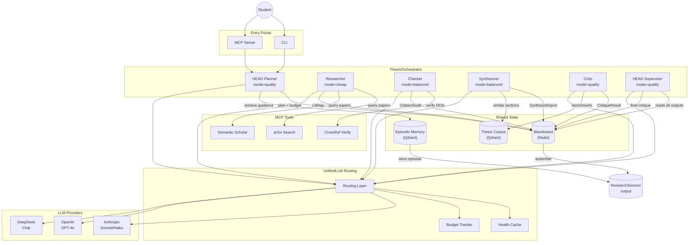

# Architecture

## Thesis Pipeline Flow



## Pipeline Stages

```
1. HEAD planner    → ResearchPlan (subquestions, search lanes, budget allocation)
2. Episodic memory → MemoryBrief (similar past tasks bias routing decisions)
3. Researcher      → LitMap (papers classified: supporting / challenging / adjacent)
4. Checker         → CitationAudit (verified, missing, weak, contested claims + BibTeX)
5. Synthesizer     → SynthesisReport (methods, datasets, metrics, corpus comparisons)
6. Corpus retrieval → similar thesis sections + structural benchmarks per discipline
7. Critic          → CritiqueResult (strengths, weaknesses, gaps, counterarguments)
8. HEAD supervisor → final CritiqueResult (merges all specialist findings, assesses viability)
9. Assemble        → ResearchSession (wraps everything, stores episode in memory)
```

## Routing Layer

The `UnifiedLLM` maps agent mode to provider and model via env vars. Each mode can use a different provider, model, or both. Examples:

| Mode | Used by | Env var |
|---|---|---|
| `quality` | HEAD planner/supervisor, critic | `THESIS_QUALITY_PROVIDER` / `_MODEL` |
| `balanced` | checker, synthesizer | `THESIS_BALANCED_PROVIDER` / `_MODEL` |
| `cheap` | researcher | `THESIS_CHEAP_PROVIDER` / `_MODEL` |

The layer checks provider health (cached 60s), tracks per-session budget, and falls back to any available provider if the preferred one fails or has no API key.

## Observability

All events emit structured JSON via `obs_logger`:

- **Session lifecycle**: start, stage completed, stage failed, pipeline completed
- **Memory**: hit count per retrieval
- **Budget**: cost per routing call
- **Traces**: route strategy, latency, success/failure

## Security Tiers

- **Public**: MCP tools (arXiv, Semantic Scholar, CrossRef), web search
- **Sanitized**: Structured data lookups, internal datasets
- **Trusted**: HEAD-only resolution, no external API calls, no worker agents
