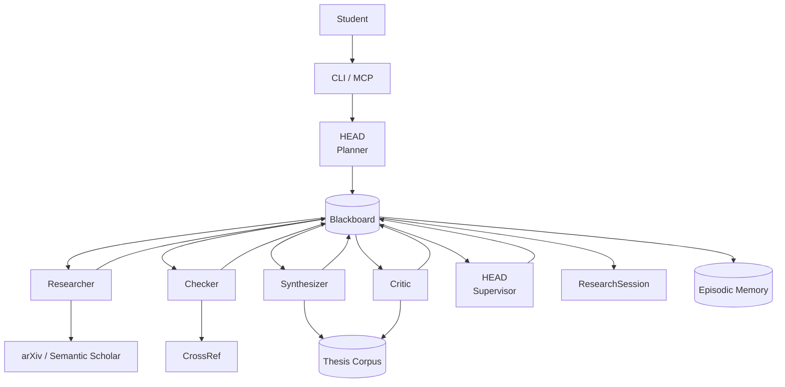

# Architecture

## Pipeline

All agents call through the UnifiedLLM router (not shown for clarity) which maps `quality` / `balanced` / `cheap` modes to Claude, ChatGPT, or DeepSeek via env vars. Corpus benchmarks make critiques data-driven  -  "your methodology is 200 words, successful CS theses average 1,100" instead of "needs more detail."

## Pipeline Stages

| # | Stage | Agent | Output |
|---|---|---|---|
| 1 | Plan | HEAD planner | `ResearchPlan`  -  subquestions, search queries, budget |
| 2 | Memory |  -  | `MemoryBrief`  -  similar past tasks bias routing |
| 3 | Search | Researcher | `LitMap`  -  papers classified supporting / challenging / adjacent |
| 4 | Audit | Checker | `CitationAudit`  -  verified, missing, weak, contested claims |
| 5 | Extract | Synthesizer | `SynthesisReport`  -  methods, datasets, corpus comparisons |
| 6 | Critique | Critic | `CritiqueResult`  -  strengths, weaknesses, gaps, counterarguments |
| 7 | Review | HEAD supervisor | final `CritiqueResult`  -  merges all findings |
| 8 | Assemble |  -  | `ResearchSession`  -  wraps everything, stores episode |

## Routing

Provider + model per mode via env vars:

| Mode | Used by | Example |
|---|---|---|
| `quality` | HEAD planner, HEAD supervisor, critic | Claude opus/sonnet |
| `balanced` | checker, synthesizer | Claude sonnet/haiku |
| `cheap` | researcher | DeepSeek |

Health checks cached 60 seconds. Budget tracked per session. Falls back to any available provider.

## Observability

Structured JSON via `obs_logger`: session lifecycle, stage events, memory hits, budget traces.
